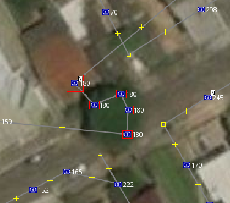
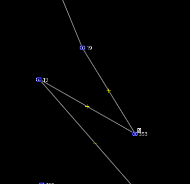
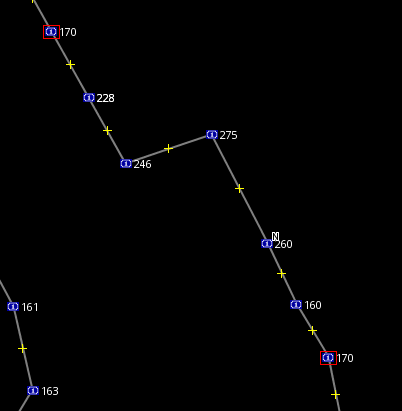
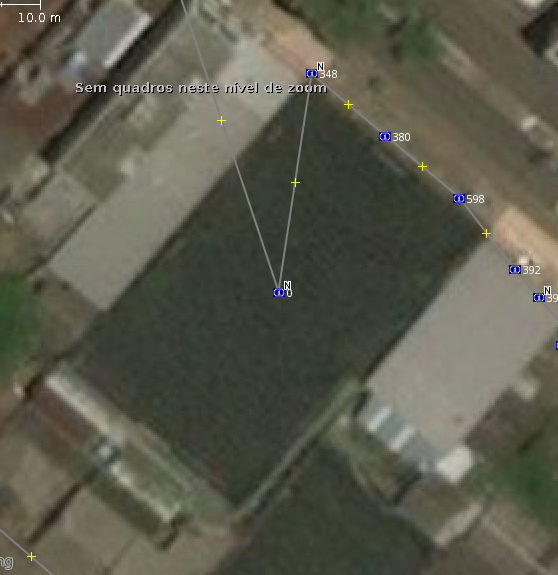
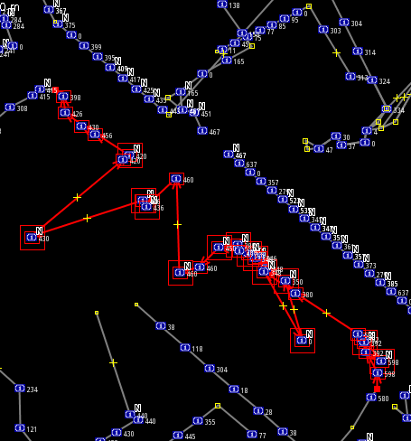
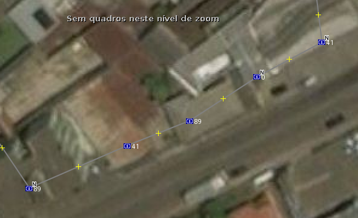
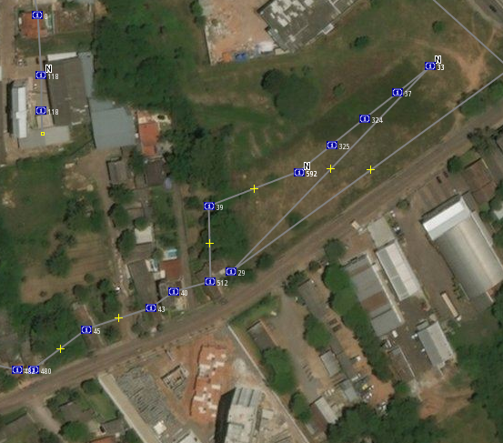

Simulação 1: Mantendo housenumbers originais
============================================

**Local do estudo:** Duque de Caxias, Sede, Santa Maria, RS

Metodologia
-----------

1. Mesclar faces e pontos em um mesmo arquivo `\*.osm`
2. Unir os pontos às faces (`Ctrl+F` → Buscar por `type:node`) e então teclar "J" para unir os pontos às linhas.
3. Selecionar todas as linhas e colocar a tag `ALINHADO=NÃO`
4. Ativar imagem de satélite para o plano de fundo + OSM Standard (esta última, neste caso, deixei desativada para que eu pudesse fazer edição às cegas, visto que nas áreas de teste já tem os números)
5. Quando todos os números de uma face foram alocados corretamente (alinhados), muda-se a linha da face para `ALINHADO=SIM`

Relatório
---------

Vários números em um mesmo ponto. Provavelmente referente aos apês e salas de um mesmo prédio.

Número 19 antes e depois do 353. Tudo levaria a crer que se referem a uma mesma _building_.

Dois 170 numa mesma face, intercalado por vários outros números. Seria de fato um número repetido encontrável _"in-loco"_?

O Join, ao grudar os nodes às _ways_, acabou grudando faces que não era para grudar. Se tiver outra maneira de grudar as faces aos nodes, melhor.

Detecção da posição de alguns nodes pela atividade nele exercida, como este onde tem uma quadra esportiva:

Vários números repetidos e que não estão em sequência, dificultando o enquadramento _node_ / _building_.

Certamente nesses casos a posição do node deixará muito a desejar.

OBSERVAÇÃO: O tempo aplicado para posicionar os pontos é similar ao tempo aplicado quando se tem a numeração colhida em campo para se colocar no OSM. Eu havia sugerido o mapeamento por município. Agora sugiro o mapeamento por subdistrito (que em boa parte dos casos será o próprio município), como havia sugerido um colega do OSM.

Exemplo de dupla desordem: 89-41-89-41

No caso seguinte sobraram vários números (muitos números para poucas casas). Provavelmente o IBGE adicionou casas de travessas como se fossem da rua. Certamente posicionar os pontos nos locais certos é um tiro no escuro:

As linhas guias eu mantive para mostrar algumas desordens numéricas. Para apagá-las no JOSM, basta procurar por `type:way` e dar `Delete`.

Conclusão
---------

A qualidade do resultado obtido deixa muito a desejar. O teste às cegas revelou que é difícil acertar exatamente o número à casa, sendo que poucas vezes isto ocorreu. Em locais onde já há casas esparsamente mapeadas, talvez seja até possível intercalar os números faltantes com base no CNEFE.

Mas isso é em casos específicos. Concluindo, portanto, que mesmo trabalhando em cima dos dados antes de subir ao OSM, este método carrega ao OSM muitos erros.

Simulação 2: Mantendo-se apenas os números de meio de quadra, como indicação do usuário Marcos Medeiros
=======================================================================================================

(a fazer em outra simulação)
